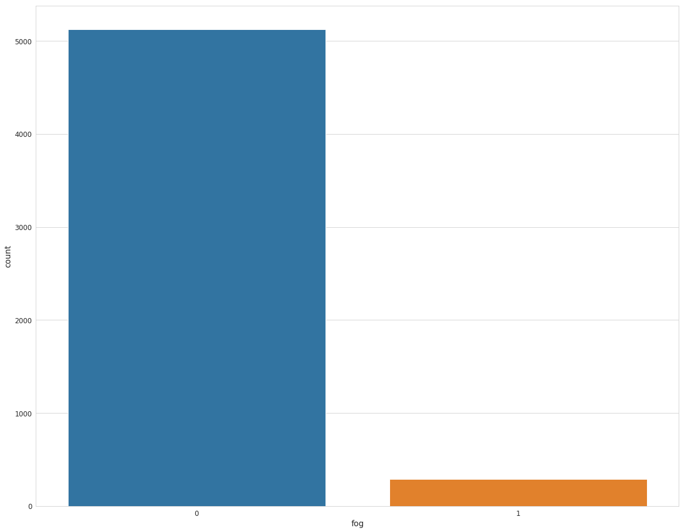
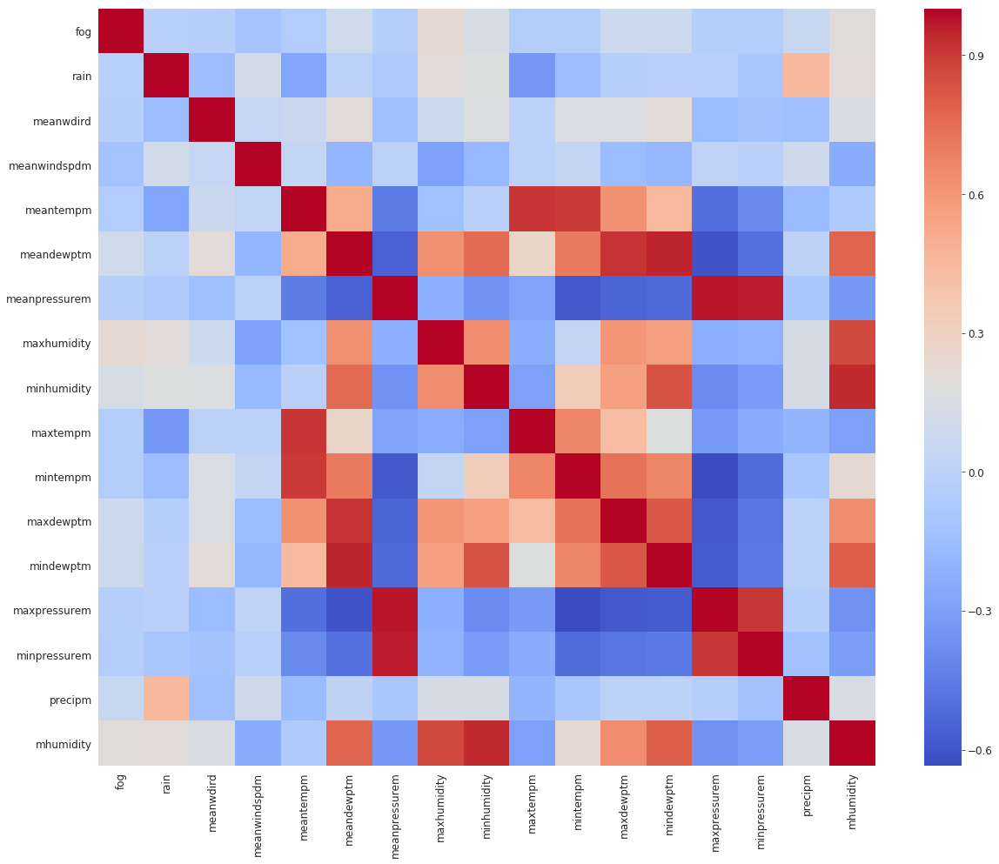
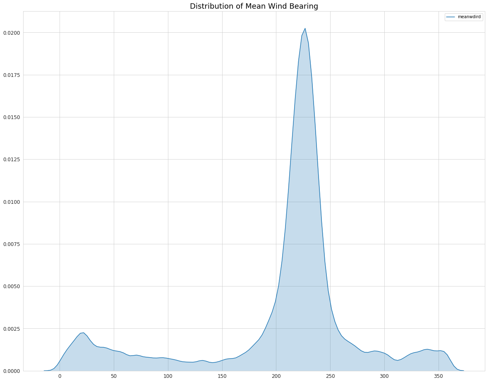
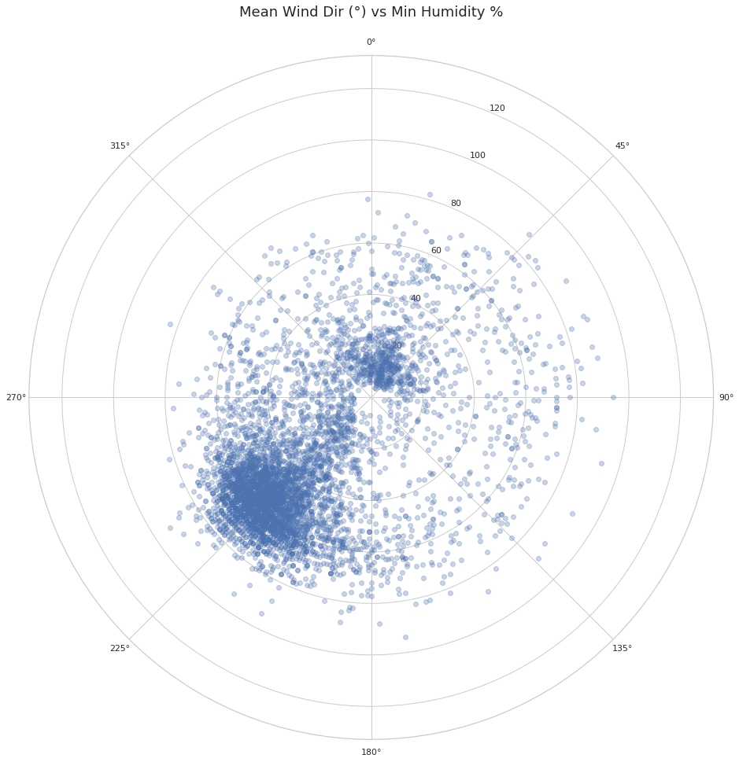

```python
# Import data science packages
%matplotlib inline
import numpy as np
import pandas as pd
import matplotlib.pyplot as plt
import seaborn as sns
from math import radians
```


```python
# Import machine learning packages
from sklearn.preprocessing import StandardScaler
from sklearn.decomposition import PCA
from sklearn.model_selection import train_test_split, KFold
from sklearn.metrics import precision_score, accuracy_score, recall_score, confusion_matrix, classification_report
from sklearn.naive_bayes import GaussianNB
from sklearn.tree import DecisionTreeClassifier
from sklearn.externals import joblib
```


```python
# Import data through preprocessing script
import preprocess_data
df = preprocess_data.init()
```


```python
sns.set_style('whitegrid')
plt.rcParams['axes.labelsize'] = 14
plt.rcParams['xtick.labelsize'] = 12
plt.rcParams['ytick.labelsize'] = 12
plt.rcParams['text.color'] = 'k'
plt.rcParams['figure.figsize'] = 20, 16
```


```python
df.head()
```


<div>
<style scoped>
    .dataframe tbody tr th:only-of-type {
        vertical-align: middle;
    }

    .dataframe tbody tr th {
        vertical-align: top;
    }

    .dataframe thead th {
        text-align: right;
    }
</style>
<table border="1" class="dataframe">
  <thead>
    <tr style="text-align: right;">
      <th></th>
      <th>date</th>
      <th>fog</th>
      <th>rain</th>
      <th>meanwdird</th>
      <th>meanwindspdm</th>
      <th>meantempm</th>
      <th>meandewptm</th>
      <th>meanpressurem</th>
      <th>maxhumidity</th>
      <th>minhumidity</th>
      <th>maxtempm</th>
      <th>mintempm</th>
      <th>maxdewptm</th>
      <th>mindewptm</th>
      <th>maxpressurem</th>
      <th>minpressurem</th>
      <th>precipm</th>
      <th>mhumidity</th>
    </tr>
  </thead>
  <tbody>
    <tr>
      <th>0</th>
      <td>1997-01-01</td>
      <td>0</td>
      <td>1</td>
      <td>236</td>
      <td>3.0</td>
      <td>18.0</td>
      <td>14.0</td>
      <td>1020.0</td>
      <td>100.0</td>
      <td>64.0</td>
      <td>20.0</td>
      <td>15.0</td>
      <td>16.0</td>
      <td>13.0</td>
      <td>1022.0</td>
      <td>1019.0</td>
      <td>0.0</td>
      <td>82.0</td>
    </tr>
    <tr>
      <th>1</th>
      <td>1997-01-02</td>
      <td>1</td>
      <td>0</td>
      <td>207</td>
      <td>5.0</td>
      <td>16.0</td>
      <td>16.0</td>
      <td>1017.0</td>
      <td>100.0</td>
      <td>94.0</td>
      <td>17.0</td>
      <td>15.0</td>
      <td>16.0</td>
      <td>15.0</td>
      <td>1020.0</td>
      <td>1016.0</td>
      <td>0.0</td>
      <td>97.0</td>
    </tr>
    <tr>
      <th>2</th>
      <td>1997-01-03</td>
      <td>1</td>
      <td>0</td>
      <td>251</td>
      <td>14.0</td>
      <td>17.0</td>
      <td>11.0</td>
      <td>1015.0</td>
      <td>100.0</td>
      <td>42.0</td>
      <td>19.0</td>
      <td>15.0</td>
      <td>15.0</td>
      <td>4.0</td>
      <td>1017.0</td>
      <td>1015.0</td>
      <td>0.0</td>
      <td>71.0</td>
    </tr>
    <tr>
      <th>3</th>
      <td>1997-01-04</td>
      <td>0</td>
      <td>0</td>
      <td>91</td>
      <td>13.0</td>
      <td>14.0</td>
      <td>11.0</td>
      <td>1019.0</td>
      <td>94.0</td>
      <td>63.0</td>
      <td>17.0</td>
      <td>13.0</td>
      <td>12.0</td>
      <td>10.0</td>
      <td>1021.0</td>
      <td>1018.0</td>
      <td>0.0</td>
      <td>78.5</td>
    </tr>
    <tr>
      <th>4</th>
      <td>1997-01-05</td>
      <td>0</td>
      <td>0</td>
      <td>281</td>
      <td>13.0</td>
      <td>13.0</td>
      <td>7.0</td>
      <td>1017.0</td>
      <td>88.0</td>
      <td>36.0</td>
      <td>16.0</td>
      <td>12.0</td>
      <td>10.0</td>
      <td>-2.0</td>
      <td>1018.0</td>
      <td>1016.0</td>
      <td>0.0</td>
      <td>62.0</td>
    </tr>
  </tbody>
</table>
</div>


```python
df.info()
```

    <class 'pandas.core.frame.DataFrame'>
    Int64Index: 5408 entries, 0 to 5477
    Data columns (total 18 columns):
    date             5408 non-null object
    fog              5408 non-null int64
    rain             5408 non-null int64
    meanwdird        5408 non-null int64
    meanwindspdm     5408 non-null float64
    meantempm        5408 non-null float64
    meandewptm       5408 non-null float64
    meanpressurem    5408 non-null float64
    maxhumidity      5408 non-null float64
    minhumidity      5408 non-null float64
    maxtempm         5408 non-null float64
    mintempm         5408 non-null float64
    maxdewptm        5408 non-null float64
    mindewptm        5408 non-null float64
    maxpressurem     5408 non-null float64
    minpressurem     5408 non-null float64
    precipm          5408 non-null float64
    mhumidity        5408 non-null float64
    dtypes: float64(14), int64(3), object(1)
    memory usage: 802.8+ KB


```python
df.describe()
```


<div>
<style scoped>
    .dataframe tbody tr th:only-of-type {
        vertical-align: middle;
    }

    .dataframe tbody tr th {
        vertical-align: top;
    }

    .dataframe thead th {
        text-align: right;
    }
</style>
<table border="1" class="dataframe">
  <thead>
    <tr style="text-align: right;">
      <th></th>
      <th>fog</th>
      <th>rain</th>
      <th>meanwdird</th>
      <th>meanwindspdm</th>
      <th>meantempm</th>
      <th>meandewptm</th>
      <th>meanpressurem</th>
      <th>maxhumidity</th>
      <th>minhumidity</th>
      <th>maxtempm</th>
      <th>mintempm</th>
      <th>maxdewptm</th>
      <th>mindewptm</th>
      <th>maxpressurem</th>
      <th>minpressurem</th>
      <th>precipm</th>
      <th>mhumidity</th>
    </tr>
  </thead>
  <tbody>
    <tr>
      <th>count</th>
      <td>5408.000000</td>
      <td>5408.000000</td>
      <td>5408.000000</td>
      <td>5408.000000</td>
      <td>5408.000000</td>
      <td>5408.000000</td>
      <td>5408.000000</td>
      <td>5408.000000</td>
      <td>5408.000000</td>
      <td>5408.000000</td>
      <td>5408.000000</td>
      <td>5408.000000</td>
      <td>5408.000000</td>
      <td>5408.000000</td>
      <td>5408.000000</td>
      <td>5408.000000</td>
      <td>5408.000000</td>
    </tr>
    <tr>
      <th>mean</th>
      <td>0.053070</td>
      <td>0.096893</td>
      <td>206.825999</td>
      <td>7.249075</td>
      <td>17.007027</td>
      <td>10.142197</td>
      <td>1015.233615</td>
      <td>84.685281</td>
      <td>49.496302</td>
      <td>21.155510</td>
      <td>13.367788</td>
      <td>12.605214</td>
      <td>7.186945</td>
      <td>1017.006287</td>
      <td>1013.526812</td>
      <td>0.599135</td>
      <td>67.090791</td>
    </tr>
    <tr>
      <th>std</th>
      <td>0.224193</td>
      <td>0.295840</td>
      <td>73.475321</td>
      <td>3.701791</td>
      <td>3.569535</td>
      <td>5.596071</td>
      <td>3.825172</td>
      <td>12.408588</td>
      <td>18.454689</td>
      <td>4.098569</td>
      <td>3.771724</td>
      <td>3.967273</td>
      <td>7.528111</td>
      <td>4.025666</td>
      <td>3.884930</td>
      <td>3.916247</td>
      <td>14.023748</td>
    </tr>
    <tr>
      <th>min</th>
      <td>0.000000</td>
      <td>0.000000</td>
      <td>-1.000000</td>
      <td>2.000000</td>
      <td>6.000000</td>
      <td>-19.000000</td>
      <td>990.000000</td>
      <td>16.000000</td>
      <td>4.000000</td>
      <td>11.000000</td>
      <td>1.000000</td>
      <td>-13.000000</td>
      <td>-23.000000</td>
      <td>998.000000</td>
      <td>976.000000</td>
      <td>0.000000</td>
      <td>11.000000</td>
    </tr>
    <tr>
      <th>25%</th>
      <td>0.000000</td>
      <td>0.000000</td>
      <td>204.000000</td>
      <td>5.000000</td>
      <td>14.000000</td>
      <td>8.000000</td>
      <td>1013.000000</td>
      <td>81.000000</td>
      <td>38.000000</td>
      <td>18.000000</td>
      <td>11.000000</td>
      <td>11.000000</td>
      <td>3.000000</td>
      <td>1014.000000</td>
      <td>1011.000000</td>
      <td>0.000000</td>
      <td>61.000000</td>
    </tr>
    <tr>
      <th>50%</th>
      <td>0.000000</td>
      <td>0.000000</td>
      <td>224.000000</td>
      <td>6.000000</td>
      <td>17.000000</td>
      <td>11.000000</td>
      <td>1015.000000</td>
      <td>87.000000</td>
      <td>55.000000</td>
      <td>21.000000</td>
      <td>13.000000</td>
      <td>13.000000</td>
      <td>9.000000</td>
      <td>1016.000000</td>
      <td>1013.000000</td>
      <td>0.000000</td>
      <td>70.000000</td>
    </tr>
    <tr>
      <th>75%</th>
      <td>0.000000</td>
      <td>0.000000</td>
      <td>236.000000</td>
      <td>10.000000</td>
      <td>19.000000</td>
      <td>14.000000</td>
      <td>1017.000000</td>
      <td>93.000000</td>
      <td>63.000000</td>
      <td>24.000000</td>
      <td>16.000000</td>
      <td>16.000000</td>
      <td>13.000000</td>
      <td>1020.000000</td>
      <td>1016.000000</td>
      <td>0.000000</td>
      <td>76.500000</td>
    </tr>
    <tr>
      <th>max</th>
      <td>1.000000</td>
      <td>1.000000</td>
      <td>360.000000</td>
      <td>50.000000</td>
      <td>30.000000</td>
      <td>21.000000</td>
      <td>1031.000000</td>
      <td>100.000000</td>
      <td>94.000000</td>
      <td>39.000000</td>
      <td>26.000000</td>
      <td>24.000000</td>
      <td>20.000000</td>
      <td>1032.000000</td>
      <td>1029.000000</td>
      <td>74.170000</td>
      <td>97.000000</td>
    </tr>
  </tbody>
</table>
</div>


```python
sns.countplot(df['fog'])
```


    <matplotlib.axes._subplots.AxesSubplot at 0x7f73c5bd2668>





```python
# We have some highly correlated features
sns.heatmap(df.corr(), cmap='coolwarm')
```


    <matplotlib.axes._subplots.AxesSubplot at 0x7f73c593a908>





# Using PCA to reduce dimensionality


```python
"""
features = ['meanwdird', 'meanwindspdm', 'meantempm', 'meandewptm', 
            'meanpressurem', 'maxhumidity', 'minhumidity', 'maxtempm', 
            'mintempm', 'maxdewptm', 'mindewptm', 'maxpressurem',
            'minpressurem', 'precipm']

# Separate out features
x = df.loc[:, features].values

# Separate out target
y = df.loc[:, ['fog']].values

# Standardize features
x = StandardScaler().fit_transform(x)

pca = PCA(n_components=2)
principal_components = pca.fit_transform(x)
principal_df = pd.DataFrame(data=principal_components, columns=['p1', 'p2'])

pca_df = pd.concat([principal_df, df[['fog']]], axis=1)

pca_df.head()

fig = plt.figure()
ax = fig.add_subplot(1,1,1) 
ax.set_xlabel('Principal Component 1', fontsize = 15)
ax.set_ylabel('Principal Component 2', fontsize = 15)
ax.set_title('2 component PCA', fontsize = 20)
targets = [0, 1]
colors = ['r', 'b']
for target, color in zip(targets,colors):
    indicesToKeep = pca_df['fog'] == target
    ax.scatter(pca_df.loc[indicesToKeep, 'p1']
               , pca_df.loc[indicesToKeep, 'p2']
               , c = color
               , s = 50)
ax.legend(targets)
ax.grid()

"""
```


    "\nfeatures = ['meanwdird', 'meanwindspdm', 'meantempm', 'meandewptm', \n            'meanpressurem', 'maxhumidity', 'minhumidity', 'maxtempm', \n            'mintempm', 'maxdewptm', 'mindewptm', 'maxpressurem',\n            'minpressurem', 'precipm']\n\n# Separate out features\nx = df.loc[:, features].values\n\n# Separate out target\ny = df.loc[:, ['fog']].values\n\n# Standardize features\nx = StandardScaler().fit_transform(x)\n\npca = PCA(n_components=2)\nprincipal_components = pca.fit_transform(x)\nprincipal_df = pd.DataFrame(data=principal_components, columns=['p1', 'p2'])\n\npca_df = pd.concat([principal_df, df[['fog']]], axis=1)\n\npca_df.head()\n\nfig = plt.figure()\nax = fig.add_subplot(1,1,1) \nax.set_xlabel('Principal Component 1', fontsize = 15)\nax.set_ylabel('Principal Component 2', fontsize = 15)\nax.set_title('2 component PCA', fontsize = 20)\ntargets = [0, 1]\ncolors = ['r', 'b']\nfor target, color in zip(targets,colors):\n    indicesToKeep = pca_df['fog'] == target\n    ax.scatter(pca_df.loc[indicesToKeep, 'p1']\n               , pca_df.loc[indicesToKeep, 'p2']\n               , c = color\n               , s = 50)\nax.legend(targets)\nax.grid()\n\n"


# Exploratory Data Analysis


```python
# We can clearly see the prevailing winds coming from a SW direction (from the ocean)
# There's also a couple interesting bumps coming from the East - the Santa Ana Winds
sns.kdeplot(df['meanwdird'], shade=True)

plt.title("Distribution of Mean Wind Bearing", fontsize=18)
```

    /home/samco/anaconda3/lib/python3.7/site-packages/scipy/stats/stats.py:1713: FutureWarning: Using a non-tuple sequence for multidimensional indexing is deprecated; use `arr[tuple(seq)]` instead of `arr[seq]`. In the future this will be interpreted as an array index, `arr[np.array(seq)]`, which will result either in an error or a different result.
      return np.add.reduce(sorted[indexer] * weights, axis=axis) / sumval


    Text(0.5, 1.0, 'Distribution of Mean Wind Bearing')





```python
sns.set(style='whitegrid')
plt.figure(figsize=(20,16))

ax = plt.subplot(111, polar=True)
ax.scatter(x=[radians(x) for x in df['meanwdird'].values], 
           y=df['minhumidity'], alpha=0.3)
ax.set_theta_zero_location('N')
ax.set_theta_direction(-1)

plt.title('Mean Wind Dir (°) vs Min Humidity %', fontsize=18);
```





# Modeling - Gaussian NB


```python
features = ['meanwdird', 'meanwindspdm', 'meantempm', 'meandewptm', 'meanpressurem', 
            'maxhumidity', 'minhumidity', 'maxtempm', 'mintempm', 'maxdewptm', 'mindewptm', 
            'maxpressurem', 'minpressurem', 'precipm']
```


```python
X = df[features]
y = df['fog']
```


```python
X = X.values.astype(np.float)
y = y.values.astype(np.float)
```


```python
sc = StandardScaler()
X = sc.fit_transform(X)
```


```python
kf = KFold(n_splits=3)
kf.get_n_splits(X)

print(kf, '\n')

for train_index, test_index in kf.split(X, y):
    print("TRAIN:", train_index, "TEST:", test_index)
    X_train, X_test = X[train_index], X[test_index]
    y_train, y_test = y[train_index], y[test_index]
```

    KFold(n_splits=3, random_state=None, shuffle=False) 
    
    TRAIN: [1803 1804 1805 ... 5405 5406 5407] TEST: [   0    1    2 ... 1800 1801 1802]
    TRAIN: [   0    1    2 ... 5405 5406 5407] TEST: [1803 1804 1805 ... 3603 3604 3605]
    TRAIN: [   0    1    2 ... 3603 3604 3605] TEST: [3606 3607 3608 ... 5405 5406 5407]


```python
clf = GaussianNB()
clf.fit(X_train, y_train)
y_pred = clf.predict(X_test)
```


```python
print(confusion_matrix(y_test, y_pred))
print('\n\n')
print(classification_report(y_test, y_pred))
```

    [[1508  194]
     [  39   61]]
    
    
    
                  precision    recall  f1-score   support
    
             0.0       0.97      0.89      0.93      1702
             1.0       0.24      0.61      0.34       100
    
       micro avg       0.87      0.87      0.87      1802
       macro avg       0.61      0.75      0.64      1802
    weighted avg       0.93      0.87      0.90      1802
    


Pickle model for later use


```python
clf_pickle = GaussianNB()
clf_pickle.fit(X, y)
joblib.dump(clf_pickle, "GauissanNB_model.pkl")
```


    ['GauissanNB_model.pkl']


# Modeling - Decision Tree

But, fewer parameters are available from the weather underground API "current conditions" service than the "historical daily summary", so we will work with the Decision Tree Classifier since it performed best with said features.


```python
features = ['meanwdird', 'meanwindspdm', 'meantempm', 'meandewptm', 'meanpressurem', 
            'mhumidity', 'precipm']
```


```python
X = df[features]
y = df['fog']

X = X.values.astype(np.float)
y = y.values.astype(np.float)

sc = StandardScaler()
X = sc.fit_transform(X)

kf = KFold(n_splits=3)
kf.get_n_splits(X)

print(kf, '\n')

for train_index, test_index in kf.split(X, y):
    print("TRAIN:", train_index, "TEST:", test_index)
    X_train, X_test = X[train_index], X[test_index]
    y_train, y_test = y[train_index], y[test_index]
```

    KFold(n_splits=3, random_state=None, shuffle=False) 
    
    TRAIN: [1803 1804 1805 ... 5405 5406 5407] TEST: [   0    1    2 ... 1800 1801 1802]
    TRAIN: [   0    1    2 ... 5405 5406 5407] TEST: [1803 1804 1805 ... 3603 3604 3605]
    TRAIN: [   0    1    2 ... 3603 3604 3605] TEST: [3606 3607 3608 ... 5405 5406 5407]


```python
dtree = DecisionTreeClassifier()
dtree.fit(X_train, y_train)
predictions = dtree.predict(X_test)
```


```python
print(confusion_matrix(y_test, predictions))
print('\n\n')
print(classification_report(y_test, predictions))
```

    [[1598  104]
     [  81   19]]
    
    
    
                  precision    recall  f1-score   support
    
             0.0       0.95      0.94      0.95      1702
             1.0       0.15      0.19      0.17       100
    
       micro avg       0.90      0.90      0.90      1802
       macro avg       0.55      0.56      0.56      1802
    weighted avg       0.91      0.90      0.90      1802
    


```python
dtree_pickle = GaussianNB()
dtree_pickle.fit(X, y)
joblib.dump(dtree_pickle, "DTree_model.pkl")
```


    ['DTree_model.pkl']


```python

```
